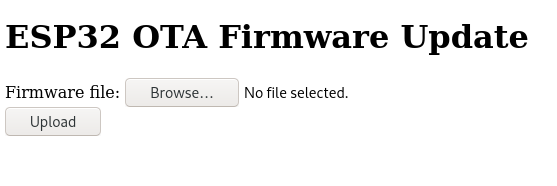

# ESP32 Over-the-Air Updates in SoftAP mode
This repository contains a minimal working example of an over-the-air (OTA) firmware updater where the ESP32 receives the update while acting as an HTTP server in SoftAP mode.
It is meant to be used with [esp-idf](https://github.com/espressif/esp-idf), though it can also be integrated into [arduino-esp32](https://github.com/espressif/arduino-esp32) projects.

It is particularly suitable for applications where you would like to deploy an ESP32 in a setting where it is not connected to the internet (i.e. automatically downloading updates is not applicable), yet the ESP32's UART interface is also not easily accessible.
In that case, firmware updates can be performed from any device with a WiFi interface and a web browser in the ESP32's range.

This project is based on [esp-idf](https://github.com/espressif/esp-idf)'s included [OTA update mechanism](https://docs.espressif.com/projects/esp-idf/en/latest/esp32/api-reference/system/ota.html), i.e. it uses a `factory` partition, a `ota_0` partition and a `ota_1` partition and updates are rolled back unless the updated firmware marks itself as valid (by calling `esp_ota_mark_app_valid_cancel_rollback()`).

## Usage
* The ESP32 broadcasts an open WiFi network with SSID `ESP32 OTA Update`. Connect to it and open [http://192.168.4.1](http://192.168.4.1) in your web browser.
* Make sure JavaScript is enabled in your Web Browser. The following website shows up:

* Click `Browse...`, select a firmware file (e.g. `esp32-softap-ota.bin`) and click `Upload`. 
* The website will upload the file and display the upload progress. If the upload is succesful and the app image is valid (magic byte), the ESP32 will reboot into the new firmware.
* Always make sure the images you upload *also contain the update functionality*, otherwise you will lose the ability to OTA-update your ESP32.
* Instead of using the builtin website, you may also upload firmware images with [cURL](https://curl.se/):
```
curl --progress-bar -X POST --data-binary @build/esp32-softap-ota.bin http://192.168.4.1/update  | tee /dev/null
```

## Initial Build and Flash
Make sure you have a recent [esp-idf](https://github.com/espressif/esp-idf) version with support for cmake-based projects installed and configured properly. Then compile and flash this project as usual using the following steps:

* `idf.py all` to compile everything
* `idf.py -p /dev/ttyUSBX flash` to flash everything

## License
This project is licensed under the MIT license. See `LICENSE` for details.
